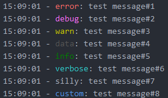
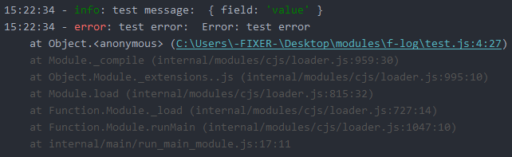

# Log - is a tiny library that modifies default console.log.

## Installation:
npm install colors

## Importing module:
#### Node.js:
const log = require('./index.js');\
or\
const {log} = require('./index.js');\
#### ES6-Modules:
import { log } from '@fixer.ru/log';\
or\
import * as log from '@fixer.ru/log';

## Example usage:
log.error('test message#1');\
log.debug('test message#2');\
log.warn('test message#3');\
log.data('test message#4');\
log.info('test message#5');\
log.verbose('test message#6');\
log.silly('test message#7');\
log.custom('test message#8');\

#####You can also pass an object as argument:\
log.info('test message: ', {field: 'value'});\
log.error('test message: ', new Error('test error'));\

